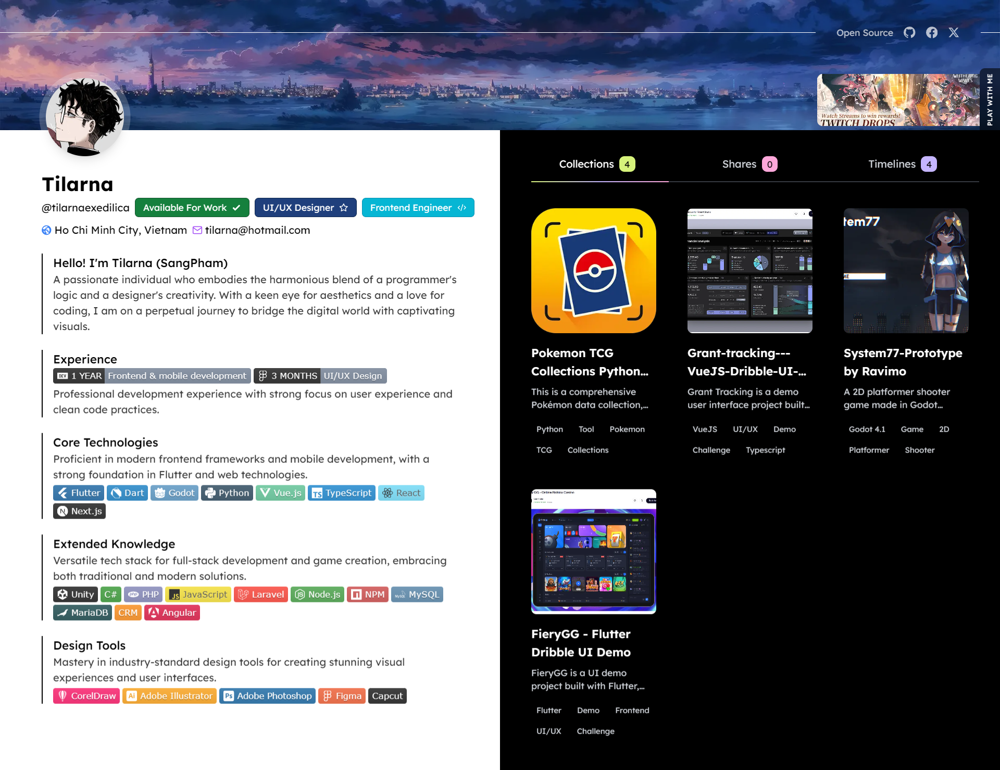
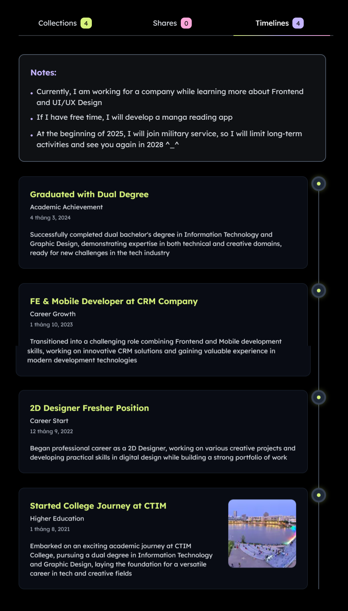

# Personal Profile

A modern and interactive personal portfolio built with Next.js, showcasing a perfect blend of elegant design and smooth animations. This project features a dynamic timeline of professional milestones, a collection showcase, and a comprehensive profile section - all wrapped in a responsive and user-friendly interface.

## Live Preview

Check out the live demo: [https://personal-profile-next-js-three.vercel.app/splash](https://personal-profile-next-js-three.vercel.app)

## Screenshots

### Profile View



### Timeline View



## Data Configuration

All data can be customized by modifying JSON files in the `/src/data` directory:

```bash
src/data/
├── profile.json          # Personal information and settings
│   ├── name             # Your name
│   ├── codename         # Your username/handle
│   ├── jobTags          # Current job status & roles
│   ├── contactInfo      # Contact information
│   ├── introduction     # Self-introduction sections
│   ├── socialLinks      # Social media links
│   └── plays            # Games currently playing
│
├── timeline.json        # Career timeline data
│   ├── notes           # Timeline header notes
│   └── timelines       # Career milestones
│       ├── id          # Unique identifier
│       ├── title       # Event title
│       ├── subtitle    # Event category
│       ├── description # Detailed description
│       ├── time        # Event date (YYYY-MM-DD)
│       └── image_url   # Optional event image
│
├── collection.json     # Project showcase data
│   └── collections     # List of projects
│       ├── id         # Unique identifier
│       ├── title      # Project name
│       ├── description # Project description
│       ├── thumbnail_url # Preview image
│       ├── post_url   # Project link
│       ├── posted_date # Publication date
│       ├── tags       # Technology tags
│       └── category   # Project category
│
└── share.json         # Shared content data
    └── shares         # List of shared items
        ├── id         # Unique identifier
        ├── title      # Share title
        ├── description # Share description
        ├── thumbnail_url # Preview image
        ├── post_url   # Share link
        ├── posted_date # Publication date
        ├── tags       # Content tags
        └── category   # Content category
```

## Quick Start Guide

Follow these steps to deploy your own portfolio:

### 1. Clone and Configure

```bash
# Clone the repository
git clone https://github.com/TilarnaExedilica/Personal-Profile---NextJS.git

# Navigate to project directory
cd Personal-Profile---NextJS

# Install dependencies
npm install

# Update your information
# Edit files in src/data/ directory:
# - profile.json
# - timeline.json 
# - collection.json
```

### 2. Test Locally

```bash
# Run development server
npm run dev

# Open http://localhost:3000 in your browser
```

### 3. Deploy to Vercel

- Push to GitHub:

```bash
git add .
git commit -m "Update personal information"
git push
```

- Deploy on Vercel:
  - Login to [Vercel](https://vercel.com)
  - Click "New Project"
  - Import your GitHub repository
  - Click "Deploy"

Your portfolio will be live at: `https://your-username.vercel.app`

### if you don't have much knowledge about programming

1. **Fork the Project**
   - Visit [https://github.com/TilarnaExedilica/Personal-Profile---NextJS](https://github.com/TilarnaExedilica/Personal-Profile---NextJS)
   - Click the "Fork" button in the top-right corner
   - Wait for GitHub to create a copy in your account

2. **Edit Your Personal Information**
   - In your forked repository, navigate to the `src/data` folder
   - Click on the file you want to edit (profile.json, timeline.json, or collection.json)
   - Click the pencil icon (Edit) in the top-right corner GitHub will open the file in the online editor
   - Update your information following the existing structure
   - Scroll down, add a commit message, and click "Commit changes"

3. **Deploy on Vercel**
   - Go to [Vercel.com](https://vercel.com) and sign in with your GitHub account
   - Click "New Project"
   - Select your forked repository
   - Click "Deploy"
   - Wait a few minutes for Vercel to build and deploy your website
   - Vercel will provide you with a URL (like `https://your-project.vercel.app`)

4. **Future Updates**
   - Return to your GitHub repository
   - Repeat step 2 to modify your information
   - Vercel will automatically update your website whenever you change the data

Note: Make sure to maintain the JSON structure when editing files. If you encounter errors, check for proper commas and brackets in the JSON files.

## Structure

```bash
src/
├── app/                   
│   ├── layout.tsx         # Root layout
│   └── page.tsx           # Page
├── components/            
│   ├── common/            # Components common
│   ├── layouts/           # Components layout
│   └── ui/                # UI components
├── config/                # Config    
│   └── config.ts
├── hooks/                 # Custom hooks
├── lib/                   # Utilities & helpers
├── services/              # Services
├── stores/                # State management
├── styles/                # CSS/SCSS files
├── types/                 # TypeScript types/interfaces
└── utils/                 # Helper functions
```

## Tech Stack

- Next.js
- Tailwind CSS
- TypeScript
